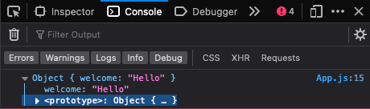
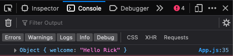
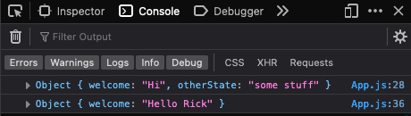
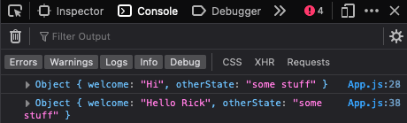
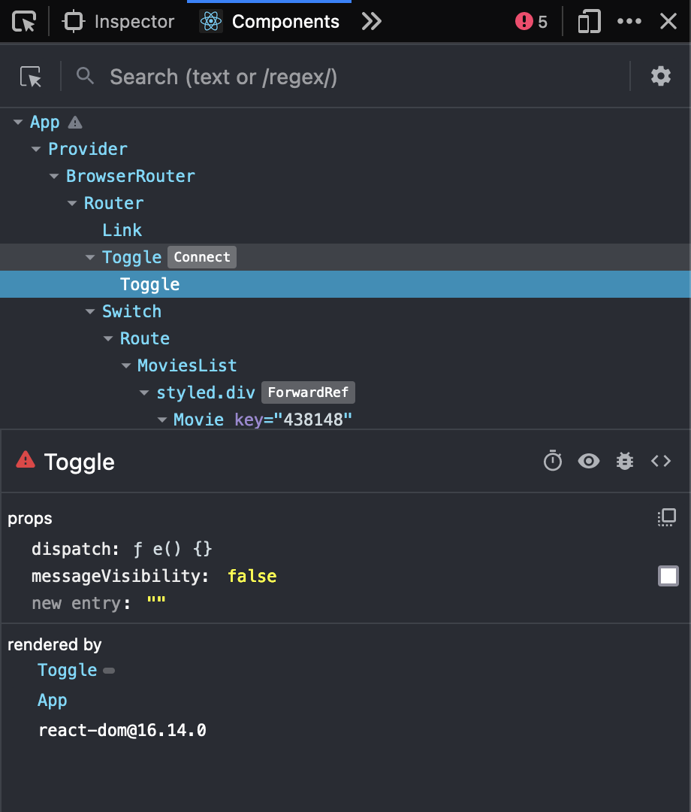
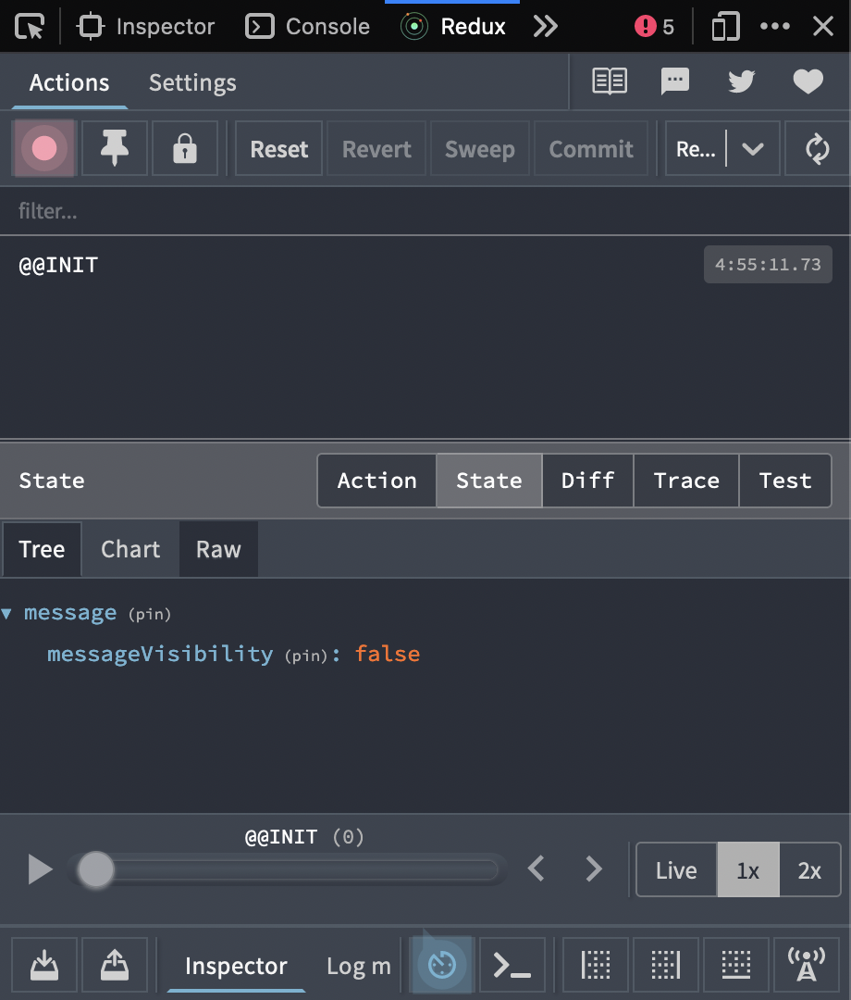

# Redux & React for Everyone


[Levelup Tutorials](https://leveluptutorials.com/) |
[Reactjs Docs](https://reactjs.org/docs/getting-started.html) |
[Reduxjs Docs](https://redux.js.org/introduction/getting-started)

## TOC

- [Redux & React for Everyone](#redux--react-for-everyone)
  - [TOC](#toc)
  - [An Introduction to Redux](#an-introduction-to-redux)
  - [Adding Redux & Our First Store](#adding-redux--our-first-store)

## An Introduction to Redux

Redux is a predictable state container for JavaScript apps.

It helps you write applications that behave consistently, run in different environments (client, server, and native), and are easy to test.

[toc](#toc)

## Adding Redux & Our First Store

_src/App.js_

```JavaScript
import { createStore } from 'redux';
import './App.css';

function App() {
  return <div className='App'></div>;
}

export default App;

const hello = () => ({
  welcome: 'Hello',
});
const store = createStore(hello);

console.log(store.getState());
```



[toc](#toc)

## Our First Reducer & Actions

_src/App.js_

```javascript
import { createStore } from 'redux';
import './App.css';

function App() {
  return <div className='App'></div>;
}

export default App;

const defaultState = {
  welcome: 'Hi',
  otherState: 'some stuff',
};

// reducer function
const greeting = (state = defaultState, action) => {
  switch (action.type) {
    case 'GREET_ME':
      return { welcome: 'Hello Rick' };
    case 'GREET_WORLD':
      return { welcome: 'Hello World' };
    default:
      return state;
  }
};

const store = createStore(greeting);
console.log(store.getState());

// action object (describer)
store.dispatch({
  type: 'GREET_ME',
});

console.log(store.getState());
```



- action is an object and describes what the action is supposed to do
- the store then uses its dispatch method to call the action



- you can see the above image, the reducer function does not modify state, it completely replaces the state tree
- in order to nullify this, you need to spread in the state first in each return from the reducer

_src/App.js_

```javascript
// reducer function
const greeting = (state = defaultState, action) => {
  switch (action.type) {
    case 'GREET_ME':
      return { ...state, welcome: 'Hello Rick' };
    case 'GREET_WORLD':
      return { ...state, welcome: 'Hello World' };
    default:
      return state;
  }
};
```


[toc](#toc)

## Properties On Actions & In Reducers

_src/App.js_

```javascript
import { createStore } from 'redux';
import './App.css';

function App() {
  return <div className='App'></div>;
}

export default App;

const defaultState = {
  welcome: 'Hi',
  otherState: 'some stuff',
};

// reducer function
const greeting = (state = defaultState, action) => {
  switch (action.type) {
    case 'GREET_NAME':
      return { ...state, welcome: `Hello ${action.name}` };
    case 'GREET_WORLD':
      return { ...state, welcome: 'Hello World' };
    default:
      return state;
  }
};

const store = createStore(greeting);
console.log(store.getState());

const name = 'Rick';

// action object (describer)
store.dispatch({
  type: 'GREET_NAME',
  name,
});

console.log(store.getState());
```



[toc](#toc)

## Adding Redux to Our React App

- `<Provider store={}></Provider>`
  - must wrap your entry point into your app (ex: for this tutorial, `App.js`)
  - this connects Redux to the react app using connect
    - makes grabbing props in and out of your components very easy and dispatching actions
  - has two parameters
    - store
    - children
- create your store and pass it into the provider

_src/App.js_

```javascript
...
import { Provider } from 'react-redux';
import { createStore } from 'redux';
...

//fake store for now
const hello = () => 'hello';
const store = createStore(hello);

const App = () => (
  <Provider store={store}>
    <Router>
      <div className='App'>
        <header className='App-header'>
          <Link to='/'>
            
          </Link>
        </header>
        <Switch>
          <Route exact path='/' component={MoviesList} />
          <Route path='/:id' component={MovieDetail} />
        </Switch>
      </div>
    </Router>
  </Provider>
);
```

[toc](#toc)

## Writing a Root Reducer

- combines all reducers in the app into one reducer
  - `combineReducers`

_src/rootRedcuer.js_

```javascript
import { combineReducers } from 'redux';

import message from './reducer';

const rootReducer = combineReducers({
  message,
});

export default rootReducer;
```

_src/reducer.js_

```javascript
const initialState = {
  messageVisibility: false,
};

export default function (state = initialState, action) {
  const { type } = action;

  switch (type) {
    case 'TOGGLE_MESSAGE':
      return state;

    default:
      return state;
  }
}
```

[toc](#toc)

## Redux DevTools

- download extension for browser
- `npm i redux-devtools-extension`
- in `App.js`
  - `import { composeWithDevTools } from 'redux-devtools-extension';`
  - pass into createStore along with initial state of the store
    - `const store = createStore(rootReducer, {}, composeWithDevTools());`
    - `composeWithDevTools` will not always be the thrid argument passed in `createStore`, if your app will use middleware, then that gets passed in before `composeWithDevTools`

[toc](#toc)

## Connecting to React

- `connect` allows to access your store in any given component easily
  - connects Redux to React

_src/Toggle.js_

```javascript
import React from 'react';
import { connect } from 'react-redux';

const Toggle = ({ messageVisibility }) => (
  <div>
    {messageVisibility &&
      <p>You will be seeing this if redux action is toggled</p>
    }
    <button>Toggle Me</button>
  </div>
);

const mapStateToProps = state => ({
  messageVisibility: state.message.messageVisibility,
});

export default connect(mapStateToProps)(Toggle);
```

- last line connects the component to the Redux store
- now when the app uses the Toggle component, it will be using an enhanced version of it since Toggle has access to the Redux store
- `mapStateToProps()` - allows you to pick which pieces of your store your component will have access to
    - as your app store scales, you don't need every component to access to the entire state tree
    - they should only have access to what they need and nothing more

_src/App.js_

```javascript
/* eslint react/no-did-mount-set-state: 0 */
import React, { Component } from 'react';
import {
  BrowserRouter as Router,
  Route,
  Switch,
  Link,
} from 'react-router-dom';
import { Provider } from 'react-redux';
import { createStore } from 'redux';
import { composeWithDevTools } from 'redux-devtools-extension';

import logo from './logo.svg';
import './App.css';

import rootReducer from './rootReducer';

import MoviesList from './MoviesList';
import MovieDetail from './MovieDetail';
import Toggle from './Toggle';

const store = createStore(
  rootReducer,
  {},
  composeWithDevTools(),
);

const App = () => (
  <Provider store={store}>
    <Router>
      <div className="App">
        <header className="App-header">
          <Link to="/">
            
          </Link>
        </header>
        <Toggle />
        <Switch>
          <Route exact path="/" component={MoviesList} />
          <Route path="/:id" component={MovieDetail} />
        </Switch>
      </div>
    </Router>
  </Provider>
);

export default App;
```

_src/reducer.js_

```javascript
const initialState = {
  messageVisibility: false,
};

export default function (state = initialState, action) {
  const { type } = action;
  switch (type) {
    case 'TOGGLE_MESSAGE':
      return state;
    default:
      return state;
  }
}
```

_src/rootReducer.js_

```javascript
import { combineReducers } from 'redux';

import message from './reducer';

const rootReducer = combineReducers({
  message,
});

export default rootReducer;
```



[toc](#toc)

## Dispatching Actions from Components

_src/reducer.js_

```javascript
const initialState = {
  messageVisibility: false,
};

export default function (state = initialState, action) {
  const { type } = action;
  switch (type) {
    case 'TOGGLE_MESSAGE':
      return {
        ...state,
        messageVisibility: !state.messageVisibility,
      };
    default:
      return state;
  }
}
```

_src/Toggle.js_

```javascript
import React from 'react';
import { connect } from 'react-redux';

const Toggle = ({ messageVisibility, dispatch }) => (
  <div>
    {messageVisibility && (
      <p>You will be seeing this if redux action is toggled</p>
    )}
    <button onClick={() => dispatch({ type: 'TOGGLE_MESSAGE' })}>
      Toggle Me
    </button>
  </div>
);

const mapStateToProps = (state) => ({
  messageVisibility: state.message.messageVisibility,
});

export default connect(mapStateToProps)(Toggle);
```

- Toggle has access to dispatch because it is a prop of connect
- in React dev Tools if you select the Toggle component, you will see in the props section `dispatch()`


- after adding an `onClick` event to the toggle button, have the arrow function return `dispatch({type: 'TOGGLE_MESSAGE'})`, you will see below in the screen shot, the toggle action fires
    - this tells Redux on this event, dispatch 'TOGGLE_MESSAGE' action
    - the reducer receives an action of 'TOGGLE_MESSAGE'
    - the reducer then looks for that action type
    - once it finds the action type, it will return whatever that type says to return, in this instance initially it just returns state (we will actually have it return new state where it will toggle `messageVisibility` to the opposite of whatever it is currently in state as


- modify the reducer to actually return what we want it to return, `{...state, messageVisibility: !state.messageVisibility}`


[toc](#toc)

## Action Creators Explained

[Action Creators](https://redux.js.org/usage/reducing-boilerplate#action-creators)

_src/Toggle.js_

```javascript
import React from 'react';
import { connect } from 'react-redux';

const Toggle = ({ messageVisibility, dispatch }) => (
  <div>
    {messageVisibility && (
      <p>You will be seeing this if redux action is toggled</p>
    )}
    <button onClick={() => dispatch({ type: 'TOGGLE_MESSAGE' })}>
      Toggle Me
    </button>
  </div>
);

const mapStateToProps = (state) => ({
  messageVisibility: state.message.messageVisibility,
});

export default connect(mapStateToProps)(Toggle);
```

- as is right now, Toggle.js does not make much sense because the action and visibility state all live within the toggle component
- the idea behind Redux to save the state in the global store if they are taking place outside the component
    - everytime you need an event to fire, do you want to have to create a function to dispatch the function? (like the `onClick` event in the avoe code)
        - Hint: no
- better to create a function 'toggleMessage' in a separate file, import that function into the component and then call that function instead
    - makes the action reusable

_src/actions.js_

```javascript
export function toggleMessage() {
  return {
    type: 'TOGGLE_MESSAGE',
  };
}
``` 

_src/Toggle.js_

```javascript
import React from 'react';
import { connect } from 'react-redux';
import { bindActionCreators } from 'redux';

import { toggleMessage } from './actions';

const Toggle = ({ messageVisibility, toggleMessage }) => (
  <div>
    {messageVisibility &&
      <p>You will be seeing this if redux action is toggled</p>
    }
    <button onClick={toggleMessage}>Toggle Me
    </button>
  </div>
);

const mapStateToProps = state => ({
  messageVisibility: state.message.messageVisibility,
});

const mapDispatchToProps = dispatch => bindActionCreators({
  toggleMessage,
}, dispatch);

export default connect(mapStateToProps, mapDispatchToProps)(Toggle);
```

[toc](#toc)

## Bind Action Creators

[toc](#toc)

## Action Type Constants

[toc](#toc)

## Adding Middleware Redux Logger

[toc](#toc)

## Redux Thunks and API Calls for Actions

[toc](#toc)

## Project Organization

[toc](#toc)

## Loading Our Data with componentDidMount

[toc](#toc)

## Loading State

[toc](#toc)

## Resetting Our Store & Props in Actions

[toc](#toc)

## Local Storage

[toc](#toc)
